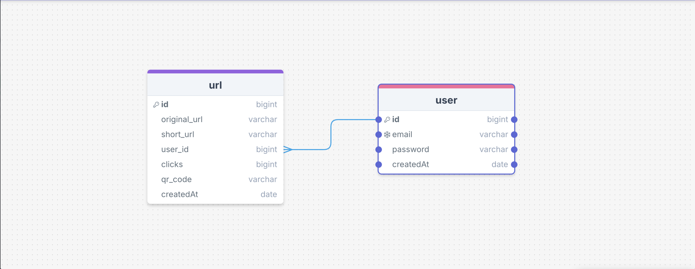

# URL-shortening-app-frontend

Neque porro quisquam est qui dolorem ipsum quia dolor sit amet, consectetur, adipisci velit.

Check out the Application [Here](https://) 

| Resource            | Link |
|---------------------|------|
| **Trello Board**     | [View Trello Board](https://trello.com/b/m0Z0nQ76/project-3-crud) |
| **GitHub Pages**    | [View Deployed App](https://) |
| **GitHub Repo**     | [View Backend Repository](https://github.com/kiran1926/URL-shortening-app-backend) |
| **GitHub Repo**     | [View Frontend Repository](https://github.com/kiran1926/URL-shortening-app-backend) 

### Key Features

- User can view their URLs.
- User can see their analytics displayed on the screen.

## Tech Stack
### Front end build using: 
 React
 ### Back end build using: 
 Mongo DB, Express

 Front end deployed using [Heroku Pages](https://www.heroku.com/)
 Back end deployed using [Metify Pages](https://www.netlify.com/)

### Clone this repository and navigate into

`git clone https://github.com/kiran1926/URL-shortening-app-backend && cd URL-shortening-app-backend`

## Documentation 

This application is deployed on [Github Pages](https://).

 ---
## Frameworks - Libraries

- What 3rd party frameworks/libraries are you considering using?

## Atributes

- image: .com

## Next Up

Build post endpoint to site to allow for people to upload their own url.

 ## Contributors
   
 ### Rosa Perez [GitHub](https://github.com/paintedlbird7)

 | Resource            | Link |
|---------------------|------|
| **Trello Board**     | [View Trello Board](https://trello.com/b/m0Z0nQ76/project-3-crud) |
| **GitHub Repo**     | [View Backend Repository](https://github.com/kiran1926/URL-shortening-app-backend) |
| **GitHub Repo**     | [View Frontend Repository](https://github.com/kiran1926/URL-shortening-app-frontend) |

Check out the Application [Here](https://) 

# RESTful Routes for URL Application

| HTTP Method | Controller       | Response | URI                          | Use Case              |
|-------------|------------------|----------|-------------------------------|------------------------|
| POST        | create           | 200      | /urls                        | Create a url          |
| GET         | index            | 200      | /urls                        | List urls             |
| GET         | show             | 200      | /urls/:urlId               | Get a single url      |
| PUT         | update           | 200      | /urls/:urlId               | Update a url          |
| DELETE      | deleteUrl       | 200      | /urls/:urlId               | Delete a url          |
| POST        | createComment    | 200      | /urls/:urlId/comments      | Create a note       |
